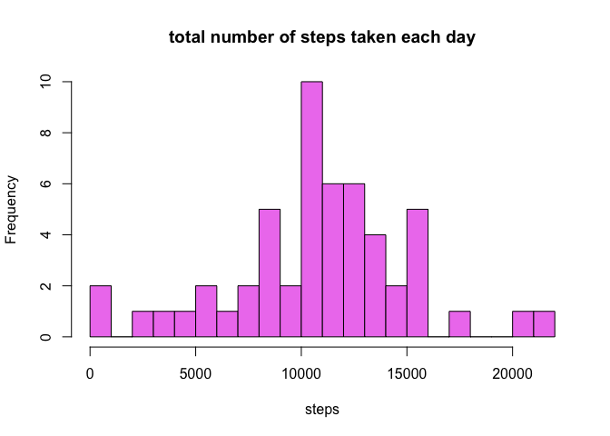
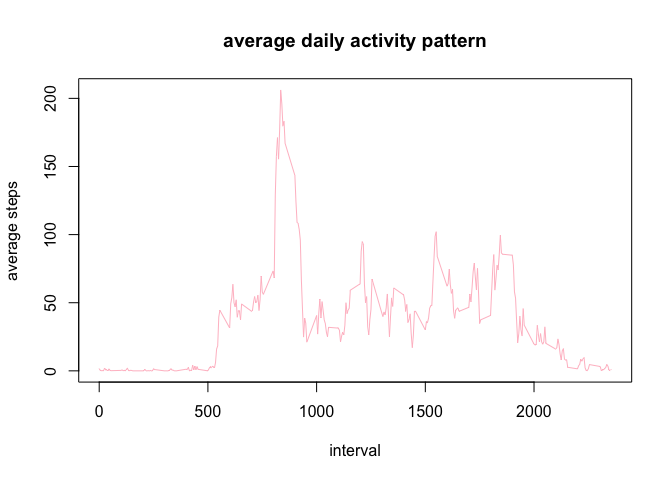
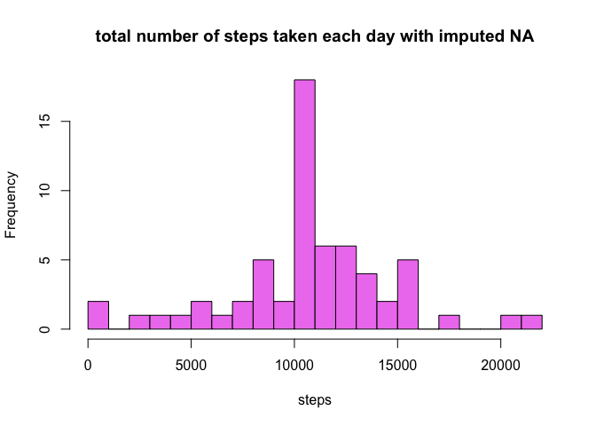
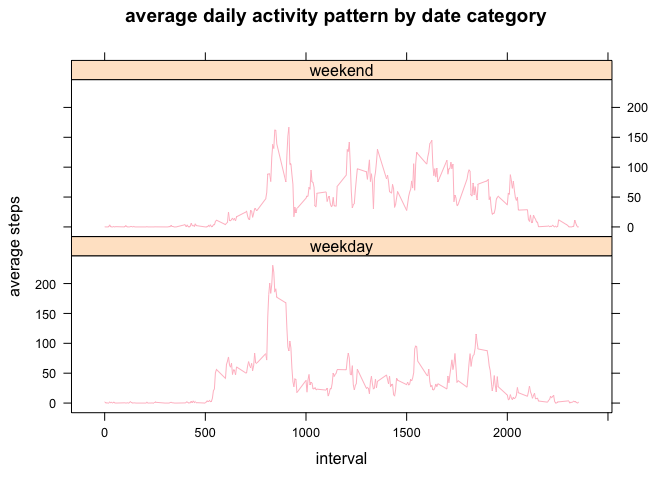

# Reproducible Research: Peer Assessment 1
Zoey ZH  
1/23/2017  


## Loading and preprocessing the data

In this document we will analyze the data about personal movement collected by activity monitoring devices. first, read data & convert Date from factor to date, we will ignore NA

```r
analysisdata<-read.csv("~/Documents/R/coursera R/coursera course 5/activity.csv")
analysisdata$date<-as.Date(analysisdata$date)
anadata1<-na.omit(analysisdata)
```
## What is mean total number of steps taken per day?
we will first histogram of the total number of steps taken each day

```r
sumdaily<-tapply(anadata1$steps,anadata1$date,sum,na.rm=TRUE)
summary(sumdaily)
```

```
##    Min. 1st Qu.  Median    Mean 3rd Qu.    Max. 
##      41    8841   10760   10770   13290   21190
```

```r
hist(x=sumdaily,col = "violet", main = "total number of steps taken each day",xlab = "steps", breaks = 30)
```

<!-- -->
then calculate the mean and median of the total number of steps taken per day

```r
mean(sumdaily)
```

```
## [1] 10766.19
```

```r
median(sumdaily)
```

```
## [1] 10765
```
the mean is 10766.19 and the median is 10765

## What is the average daily activity pattern?

Make a time series plot of the 5-minute interval and the average number of steps taken, averaged across all days 

```r
aveinterval<-tapply(anadata1$steps,anadata1$interval,mean,na.rm=TRUE)
dfaveint<- data.frame(interval=as.integer(names(aveinterval)), avg=aveinterval)
```
here is the plot

```r
plot(dfaveint$interval,dfaveint$avg,col = "pink", type = "l",main = "average daily activity pattern",xlab = "interval",ylab = "average steps")
```

<!-- -->
Which 5-minute interval contains the maximum number of steps?

```r
max(dfaveint$avg)
```

```
## [1] 206.1698
```

```r
dfaveint[which.max(dfaveint$avg),]
```

```
##     interval      avg
## 835      835 206.1698
```
the 835 interval contains teh maximum number of steps which is 206.17

## Imputing missing values

Calculate and report the total number of missing values in the dataset (i.e. the total number of rows with 𝙽𝙰s)

```r
sum(is.na(analysisdata))
```

```
## [1] 2304
```

```r
sum(is.na(analysisdata$steps))
```

```
## [1] 2304
```
the total number of missing calues in the dataset is 2304 and only variable "steps" has NA. 
Then we will imput the missing data using the mean of the interval

```r
analysisdata1<-analysisdata
naimput<-is.na(analysisdata1$steps)
aveperint<-tapply(analysisdata1$steps,analysisdata1$interval,mean,na.rm=TRUE)
analysisdata1$steps[naimput] <-aveperint[as.character(analysisdata1$interval[naimput])]
```
histgram the data

```r
sumdaily1<-tapply(analysisdata1$steps,analysisdata1$date,sum,na.rm=TRUE)
hist(x=sumdaily1,col = "violet", main = "total number of steps taken each day with imputed NA",xlab = "steps", breaks = 30)
```

<!-- -->

```r
mean(sumdaily1)
```

```
## [1] 10766.19
```

```r
median(sumdaily1)
```

```
## [1] 10766.19
```
the mean and the median becomes the same after we imput data. And the maximum of total daily number of steps increase.
## Are there differences in activity patterns between weekdays and weekends?

Create a new factor variable in the dataset with two levels – “weekday” and “weekend” 

```r
analysisdata1$day<-weekdays(as.Date(analysisdata1$date))
for (i in 1:nrow(analysisdata1)) {
  if (analysisdata1$day[i] == "Saturday" | analysisdata1$day[i] == "Sunday") {
    analysisdata1$datecat[i] = "weekend"
  } else {
    analysisdata1$datecat[i] = "weekday"
  }
}
```
panel plot containing a time series plot 

```r
library(lattice)
library(plyr)
aveinterval1<-ddply(analysisdata1,.(interval, datecat), summarize, average=mean(steps))
xyplot(average~interval|datecat, data = aveinterval1,type="l",col="pink", layout=c(1,2), main = "average daily activity pattern by date category",xlab = "interval",ylab = "average steps" )
```

<!-- -->
in weekday, the maximum steps generate during interval 500-1000 and in weekend, the steps generate equally during about 750-2000. 
